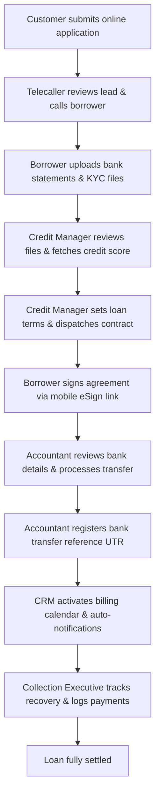
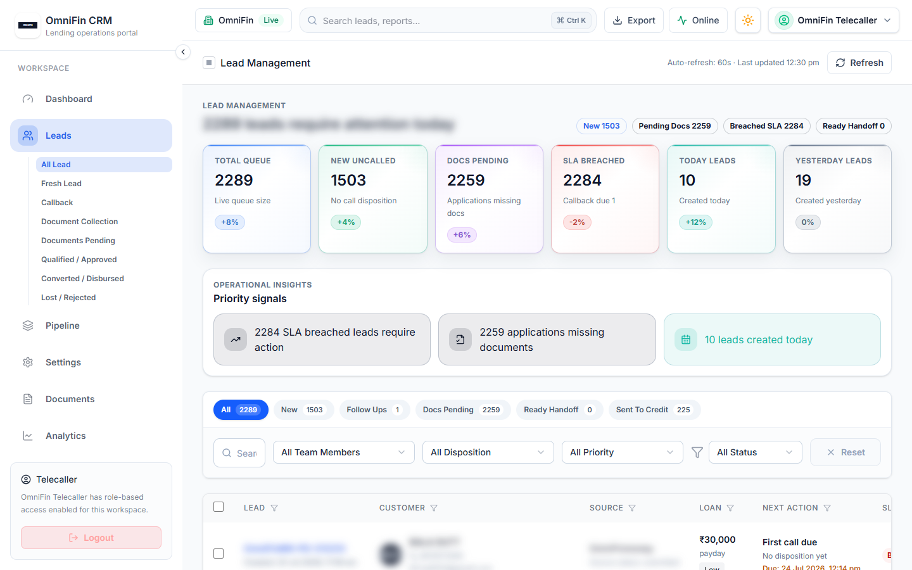
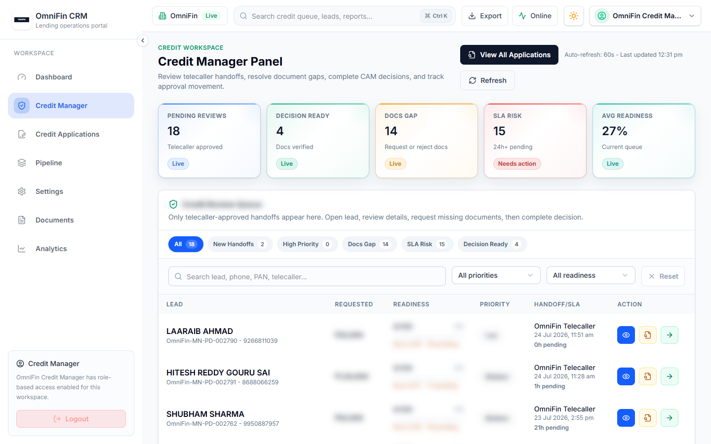
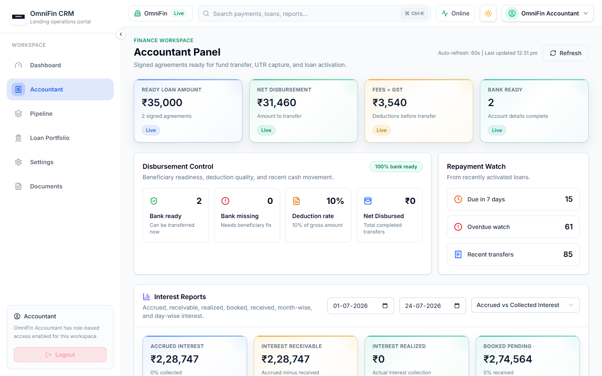
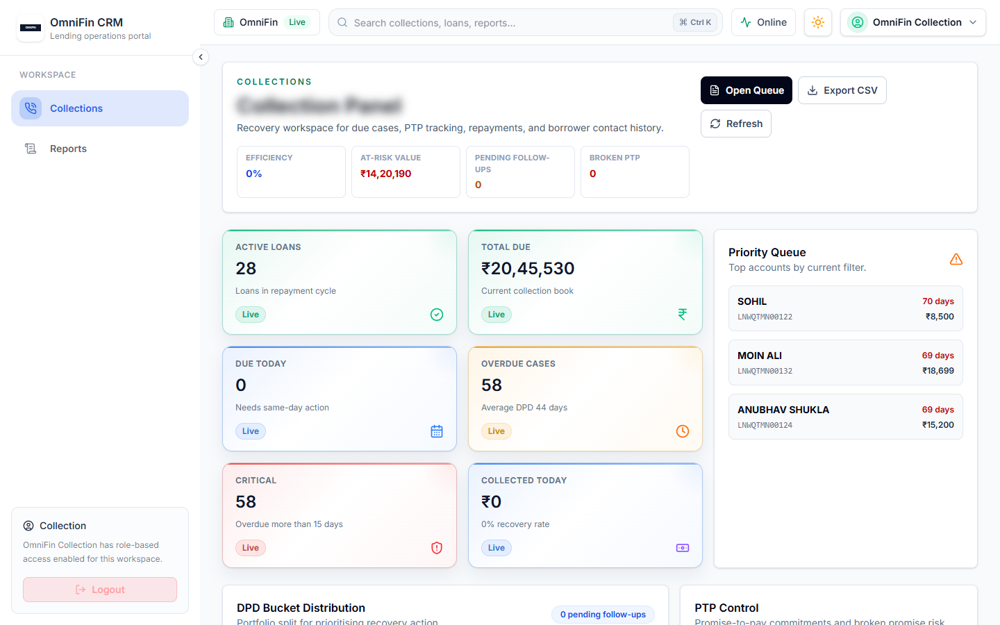
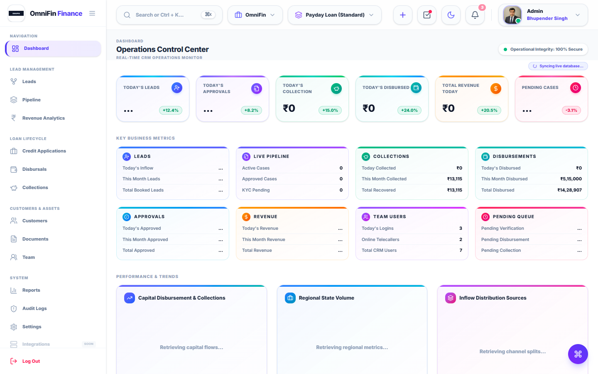
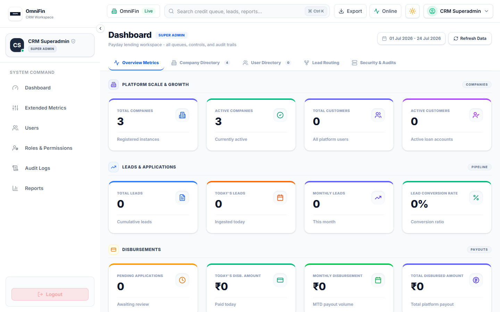

# OmniFin CRM: End-to-End Operational Manual & Product Specifications

Welcome to the **OmniFin Loan Lifecycle CRM** operational manual. This document is written for non-technical users and business clients. It explains the purpose, roles, step-by-step loan journey, and functionality of every panel in the system, utilizing anonymized mockup screenshots.

---

## 📖 Table of Contents
1. [User Personas & Operational Roles](#1-user-personas--operational-roles)
2. [The Step-by-Step Loan Journey (Roadmap)](#2-the-step-by-step-loan-journey-roadmap)
3. [Telecaller Workspace & Lead Verification](#3-telecaller-workspace--lead-verification)
4. [Customer Document Upload Portal](#4-customer-document-upload-portal)
5. [Credit Manager Panel & Underwriting Desk](#5-credit-manager-panel--underwriting-desk)
6. [Customer Digital Signature Workspace (eSign)](#6-customer-digital-signature-workspace-esign)
7. [Accountant Panel & Disbursal Hub](#7-accountant-panel--disbursal-hub)
8. [Collections Board & Recovery Management](#8-collections-board--recovery-management)
9. [Smart Integrations (How They Work in Simple Terms)](#9-smart-integrations-how-they-work-in-simple-terms)
10. [Admin (Product Admin) Panel Specifications](#10-admin-product-admin-panel-specifications)
11. [Superadmin Tenant Console](#11-superadmin-tenant-console)

---

## 1. User Personas & Operational Roles

To maintain high security and separate business duties, the CRM is divided into five core business roles. Each user logs in to a dedicated workspace.

*   **Telecaller**: The primary contact agent. Their job is to call fresh leads, filter out junk profiles, update callback status, and request financial documents.
*   **Credit Manager**: The underwriting expert. They check credit scores, run identity verifications, calculate risk, define approved loan limits (principal, fees, and repayment dates), and issue official contract documents.
*   **Accountant**: The payment manager. They verify the borrower's bank details, calculate net disbursals, execute bank transfers, and input transaction IDs (UTRs) to activate loan billing.
*   **Collection Executive**: The recovery specialist. They track active loans, follow up on overdue repayments, log payment promises (PTP), and send payment collection links.
*   **Operations Admin**: The supervisor. They oversee operational dashboards, track employee performance, adjust system configurations, verify security audit logs, and pull reports.

---

## 2. The Step-by-Step Loan Journey (Roadmap)

Here is how a loan flows through the system from the moment a customer applies to the final recovery.

---

## 3. Telecaller Workspace & Lead Verification

The Telecaller Workspace is the primary landing portal for lead sorting, customer verification calls, and document collection triggers.

### A. Leads Data Grid Columns
The main leads table displays critical borrower parameters for quick scanning:
*   **Lead ID**: A unique, prefix-bound identifier (e.g., `OMNI-PD-002794`) that isolates this case.
*   **Created Date**: Timestamp indicating exactly when the customer submitted the online form.
*   **Customer Name**: The legal name of the borrower (blurred in mockups for privacy).
*   **Mobile Number**: Primary contact detail (blurred in mockups for privacy).
*   **PAN Number**: The borrower's taxpayer ID (blurred in mockups for privacy).
*   **Applied Amount**: The loan value requested by the borrower (e.g., ₹25,000).
*   **Assigned Agent**: The telecaller agent responsible for this lead.
*   **Status Badge**: A colored badge indicating the exact pipeline stage (e.g., `New Lead`, `Contacted`, `Documents Pending`).

### B. Interactive Pipeline Tabs (Lead Sorting)
Leads are automatically distributed into specific tabs based on their calling status:
*   **All Leads**: Consolidated list of all prospects assigned to the agent.
*   **Fresh Lead**: Newly ingested applications that have not been called yet.
*   **Callback**: Borrowers who requested a follow-up call at a specific date and time.
*   **Not Interested**: Prospects who declined the loan offer.
*   **No Answer**: Leads where the agent attempted a call but received no response.
*   **Not Eligible**: Borrowers who do not meet initial criteria (e.g., age, income limits).
*   **Duplicate / Duplicate Lead**: System flags matching PAN or mobile numbers.
*   **DNC**: Do Not Call registry exclusions.
*   **Incomplete Documents**: Cases where the borrower started but did not complete uploads.
*   **Interested**: Prospects who confirmed interest and need documents collected.
*   **Document Received**: Leads that have successfully uploaded all files.
*   **Blacklisted**: Profiles flagged for fraud or past defaults.
*   **Rejected Case**: Applications rejected during initial telecalling checks.

### C. Search & Quick Filters
Agents can filter thousands of leads instantly using the search bar:
*   Search works dynamically by typing the borrower's **Name**, **Mobile Number**, or **PAN**.
*   Leads can be sorted by **Applied Date** (newest first) or **Loan Amount**.

### D. Interactive Action Drawer (The Side Panel)
Clicking a lead row opens a slide-out panel on the right. This is where the agent logs all call results:
*   **Call Disposition Dropdown**: Set call results (e.g., Callback, No Answer, Interested, Rejected).
*   **Callback Scheduler (Date & Time Picker)**: If "Callback" is selected, the agent sets a specific date and time. The CRM will automatically alert the agent when the callback time arrives.
*   **Remarks Editor Feed**: An input box where the agent types detailed notes (e.g., *"Customer salary credits on the 30th; requested call back after 6 PM"*).
*   **Historical Comments Timeline**: A scrollable list showing previous remarks logged by other callers. This prevents multiple agents from asking the borrower the same questions.
*   **Send Upload Link Button**: Triggers the SMS/WhatsApp dispatch service, sending a secure, tokenized file upload URL to the customer's mobile.

---

## 4. Customer Document Upload Portal

A secure, mobile-friendly upload page sent to the customer's phone where they can complete their documentation.

### Key Features & How They Work:
*   **Simple Document Checklist**: The customer sees exactly what is needed (e.g. PAN Card copy, Aadhaar card front & back, and the last 3 months of bank statements).
*   **Instant Camera Capture**: Customers can take photos of their physical documents using their mobile camera or upload PDF files directly.
*   **Auto-Sync**: As soon as files are uploaded, they sync directly to the Credit Manager's panel. No manual emailing is required.

---

## 5. Credit Manager Panel & Underwriting Desk

Where underwriters evaluate applicant creditworthiness, configure final loan terms, and issue contract documents.

### A. Underwriting Verification Dossier (The Tabbed Panel)
The Credit Manager has access to a structured dashboard to audit applicant credentials:
1.  **Personal Details**: Displays full legal name, Date of Birth (DOB), gender, father's/mother's name, current residential address, permanent address, employment type (salaried vs. self-employed), monthly net salary, employer name, and corporate work email.
2.  **Bank Statements**: Displays account details (Bank Name, Account Number, IFSC code, and Account Holder Name) alongside a built-in PDF viewer for bank statements. It highlights Monthly Average Balances (MAB) and monthly salary credit dates.
3.  **References**: Lists details of two mandatory contacts (Name, Relationship, and Phone Number) to verify borrower references.
4.  **Aadhaar eKYC**: Shows verified details directly from government databases, including the official name, DOB, verified residential address, transaction tokens, and the official profile photograph.
5.  **CIBIL Bureau Report**: Pulls credit histories instantly. It displays the credit score card (e.g., 748), total active loan accounts, number of overdue credit lines, and recent inquiries.
6.  **AI Credit Analysis**: Displays an AI-generated risk summary (e.g., *"Low risk. Customer has consistent monthly salary credits and no past defaults"*), speeding up underwriting audits.
7.  **Audit Log Trail**: A log showing who worked on this lead (e.g., who verified the bank statement, who pulled the CIBIL score, and who changed status).

### B. Decision Constructor & Terms Setting
At the bottom of the underwriter desk, the Credit Manager configures the approved loan:
*   **Reject Application**: Rejects the application and opens a dropdown to select the rejection reason code (e.g., low credit score, income mismatch, unserviceable location).
*   **Loan Terms Configurator (Input Fields)**:
    *   *Approved Principal*: The approved loan amount (e.g., ₹10,000 to ₹50,000).
    *   *Daily Interest Rate*: Sets the interest rate (e.g., 0.1% daily).
    *   *Tenor (Days)*: Input for loan duration (e.g., 15 days, 30 days).
    *   *Processing Fee*: Sets the platform processing charge.
    *   *GST on Fees*: Automatically calculates 18% tax on the processing fee.
    *   *Net Payout (Auto-Calculated)*: Displays the exact amount to disburse (Principal minus Processing Fee & GST).
    *   *Repayment Date*: Sets the repayment date on the calendar.
    *   *NBFC Lender Selection*: Dropdown to select the funding NBFC partner for this contract.
*   **Issue Sanction Letter Button**: Automatically generates the customized, tenant-branded loan Sanction Letter PDF, signs it, and sends the eSign link to the borrower.

---

## 6. Customer Digital Signature Workspace (eSign)

A secure eSign interface where customers review their approved loan contract.

### Key Features & How They Work:
*   **Contract Review Panel**: Displays the legal terms sheet, including the approved loan amount, fees, interest rate, total repayment amount, and overdue penalties in clear text.
*   **Secure eSign Verification**: The customer completes the eSign process by entering an OTP sent to their mobile number, signing the agreement legally in seconds.
*   **Automated Status Alerts**: Once signed, the system notifies the underwriter and accountant, moving the application to the Accountant payout queue.

---

## 7. Accountant Panel & Disbursal Hub

The final step in releasing money to the customer. This panel manages bank details, calculations, and billing activations.

### Key Features & How They Work:
*   **Net Payout Calculator**: To prevent human errors, the system automatically subtracts processing fees and GST from the principal, showing the exact net amount to transfer to the customer (e.g. Approved Principal: ₹10,000 | Net Payout: ₹8,800).
*   **Bank Account Verification**: Displays the customer's account holder name, bank name, account number, and IFSC code for final verification.
*   **UTR Transaction Binding**: After initiating the transfer from the bank portal, the Accountant inputs the unique Bank UTR transaction ID.
    *   *Billing Activation*: Submitting the UTR locks the loan file, shifts its status to "Disbursed", and activates the automated billing cycle.

---

## 8. Collections Board & Recovery Management

Where collection executives manage active repayments, track defaults, and process collections.

### Key Features & How They Work:
*   **Days Past Due (DPD) Buckets**: Loans are categorized automatically into recovery lists based on default severity:
    *   *DPD 1-3*: Early reminders for customers who missed their date by 1 to 3 days.
    *   *DPD 4-7*: Active follow-up lists.
    *   *Default/NPA*: Serious defaults that need manual legal notices.
*   **PTP (Promise to Pay) Tracker**: When a borrower promises to repay on a specific day, the executive logs it as a "Promise to Pay" (PTP). The system schedules automated follow-up reminders for that date.
*   **Generate Cashfree Payment Links**: Executive clicks a button to generate a Cashfree UPI payment link and sends it via WhatsApp. Once paid, the loan updates to "Repaid" automatically.

---

## 9. Smart Integrations (How They Work in Simple Terms)

OmniFin uses six smart integrations to automate manual operational tasks.

*   **Aadhaar eKYC Identity Gate**: Verifies the customer's real identity. The customer enters an OTP, and the CRM fetches their official name, date of birth, address, and profile photo directly from government records, preventing identity fraud.
*   **CIBIL Credit Score Check**: Fetches the customer's credit score in real time. It highlights previous defaults and active loan totals with one click.
*   **AI-Powered Risk analysis**: A built-in AI module reads dense credit scores and outputs a simple summary (e.g., "Medium Risk: Borrower has 2 active credit cards and 0 past defaults") to assist the underwriter.
*   **Digio eSign Portal**: Generates the digital contract PDF, handles mobile signatures, and files the legally binding document in the system automatically.
*   **Cashfree Collections Gateway**: Auto-generates payment links and coordinates real-time settlements, updating payment statuses instantly.
*   **WhatsApp Automated Reminders**: Sends transaction receipts, document upload links, and collection warnings to the customer's WhatsApp chat automatically.

---

## 10. Admin (Product Admin) Panel Specifications

The Admin Panel serves as the central operations console. It provides full transparency over pipelines, financials, and agent activity.

### A. Operational KPIs & Statistics
The main dashboard consolidates live transaction values:
*   **Total Disbursed Capital**: Total currency value processed and transferred to borrowers.
*   **Active Outstanding Capital**: Active loan principal currently in circulation.
*   **Collections Rate**: Percentage ratio of recovered funds against due amounts.
*   **Yield Margins**: Detailed metrics tracking accrued interest returns.

### B. Visual Lead Kanban Pipeline
A kanban board mapping the distribution of leads across the lending process:
*   **Stages Mapped**: *Ingestion*, *Documentation*, *Credit Underwriting*, *eSign Pending*, *Accountant Payout*, *Disbursed*, and *Collections*.
*   Helps managers identify operational bottlenecks and reallocate team members to busy stages.

### C. Revenue Analytics Dashboard
Provides tools for accounting and financial monitoring:
*   **Revenue Graphs**: Charts displaying yields from processing fees, interest earnings, overdue penalty charges, and GST collections.
*   **Financial Exports**: Generates standard spreadsheets (CSV/XLS) for tax compliance and audit reconciliations.

### D. Customers Master Registry
*   A consolidated database indexing every borrower profile in the system.
*   Allows lookups by customer ID or PAN card, linking to historical loan accounts and payment logs.

### E. Document Repository Console
*   A secure file management dashboard displaying uploaded KYC files (Aadhaar, PAN) and signed loan contracts.
*   Allows sorting by document type for quick compliance reviews.

### F. Tenant Team Management Console
*   **Duty Switches**: Toggle agent availability to instantly add or remove telecallers/underwriters from the automated lead routing queue.
*   **Product Mapping**: Map specific agents to different loan portfolios (Standard, Express, Flexi).

### G. System Settings & Webhook Integrations
*   **Branding Selector**: Allows admins to customize hexadecimal colors for dynamic dashboard theme updates.
*   **Webhooks Configurator**: Configures webhook listeners to notify third-party affiliate systems when a loan changes status.

### H. MIS & SLA Reports List
A centralized console to generate operational reports:
*   *Lead Report*: Track lead conversions by source.
*   *Disbursement Report*: Accountant payout lists sorted by date.
*   *DPD Bucket Report*: Breakdown of overdue accounts.
*   *Outstanding Report*: Active loan balances.
*   *Employee Performance*: Calling and appraisal speed metrics per agent.
*   *Audit Log Report*: Historical trail of administrative modifications.

---

## 11. Superadmin Tenant Console

The master control panel to manage multi-tenant setups and global system parameters.

### A. Tenant Generation & Subdomain Mappings
*   **Spin Up New Brands**: Create a new lending brand instantly by entering a name (e.g., *ApexLend*) and binding it to a custom subdomain (e.g., <code>apexlend.crm.com</code>).
*   **Custom Series Mappings**: Configure unique loan reference codes (e.g., `APEX-PD-`) for each tenant brand to separate accounts.
*   **Portal Toggle**: A master switch to activate or deactivate tenant portals instantly.

### B. Dynamic SMTP Parameter Isolation
*   Enables separate SMTP parameters (Host, Port, User, Password, TLS) for each tenant brand.
*   Ensures client emails (sanction sheets, payout receipts) originate from the brand's own domain name.

### C. Third-Party Messaging Credentials Setup
*   Configure custom credentials for APIs (SMS gateways, WhatsApp routes, Cashfree collection links) at the tenant level.
*   Ensures transaction charges and bills are routed to the appropriate brand.

### D. Global Lead Allocation Rules
*   **Round-Robin Routing**: Automated lead allocation to active telecallers.
*   **Weight Configurations**: Set maximum lead limits per agent to balance workloads.

